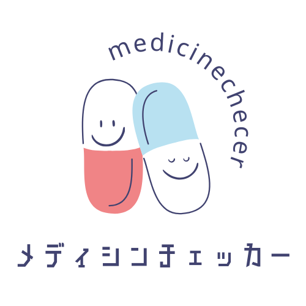

# サービス名: [medicinechecker（メディカルチェッカー）](https://medicine-checker.com/)

# ■サービス概要

このサービスは、病院から処方された薬の服用管理を簡単に行えるアプリです。ユーザーは、服用する薬名を入力し、服用するタイミング（朝、昼、夜、寝る前など）を選択し、病院から指示された服用期間を入力して登録することができます。また、複数の病院から処方された薬を一元管理し、どの病院からどの薬が処方されたかを検索で容易に把握できます。

さらに、カレンダー機能を搭載しており、過去の服用状況や今後の服用予定を一目で確認できます。リマインダー機能も備えており、夜の9時に通知します。このサービスにより、ユーザーは薬の服用を忘れることなく、効果的に健康管理を行うことができます。

# ■ このサービスへの思い・作りたい理由
このサービスを作りたいと思ったきっかけは、私の父親が薬の服用管理が苦手で、薬の服用を忘れてしまうことが多かったからです。
何度か救急車で病院に運ばれる事態にもなり、この問題を何とか解決できないかと考えました。薬の服用管理をアプリで行うことで、父親のように薬の服用を忘れがちな人々の健康を守りたいと考えています。

また、私自身も薬の服用を忘れてしまうことがあり、同じような悩みを抱える人が多いのではないかと思いました。
このアプリを通じて、薬の服用を習慣化、健康を維持する手助けができればと考えています。

# ■ ユーザー層について

・高齢者およびその介護者

高齢者の中には薬の服用管理が難しい人が多く、服用を忘れることで健康リスクが高まります。このアプリは、介護者が高齢者の薬の服用を遠隔で確認・管理できるようにし、安心して生活できる環境を提供します。

・家族や介護者：家族や介護者が、被介護者の服用状況をカレンダーで簡単に確認できるため、適切なサポートを提供しやすくなります。

# ■サービスの利用イメージ
|新規登録| ログイン|
|:-:|:-:|
|||
|`sorcery`で会員登録・ログイン機能を実装しました。|メールアドレスで登録したユーザーはパスワードを再設定できます。|

|薬登録機能|検索機能|
|:-:|:-:|
|||
|薬や病院名、錠数や画像、服用期間や複数の服用タイミングを登録することができます。|`ransack`を使用して薬や病院名、服用タイミングをすぐに検索できるようにしています。|

|チェック機能|カレンダー|
|:-:|:-:|
|||
|服用した薬をチェックすると記録することができます。|カレンダー機能を追加することで、服用状況を視覚的に把握できるようにし、自己管理能力を高めることができます。また、家族や介護者もカレンダーを通じて服用状況を確認できるため、適切なサポートを提供しやすくなります。|

|メモ機能|リマインド機能|
|:-:|:-:|
|||
|家族の状態を薬と一緒に記録することで日々の変化を記録することができます。|毎日夜の9時にリマインド通知がLINEに送られてきます。|

# ■ サービスの差別化ポイント・推しポイント
他のサービスにはカレンダーにメモ機能はありませんが自分サービスにはメモ機能を追加することで、家族の状態も薬と一緒に保存することができます

他の服用管理アプリは体重を記録したり、血圧を記録したり、体温を記録できるアプリがほとんどだったのですが、服用管理だけができるアプリを目指して作りたいので、機能を絞り込んでアプリ利用のハードルを下げ、手軽に服用管理と病院登録ができるようにし、他のサービスと差別化を図りたいと思っています。

### 画面遷移図
Figma: https://www.figma.com/file/x7VPMITUhxidxNnQQRzX2z/LifeSpark?type=design&node-id=0%3A1&mode=design&t=GLFmunPY1SkPYLIq-1

### ER図

■技術スタック
| カテゴリ | コンテンツ技術 |
| --- | --- |
| サーバーサイド | Ruby on Rails ・Ruby|
| cssフレームワーク | Tailwindcss + daisyUI |
| web API |LINE Messaging API｜
|ファイルサーバー | AWS S3 |
| データベース | PostgreSQL |
| アプリケーションサーバー | heroku |
| バージョン管理ツール | GitHub |
| その他 | Docker |

